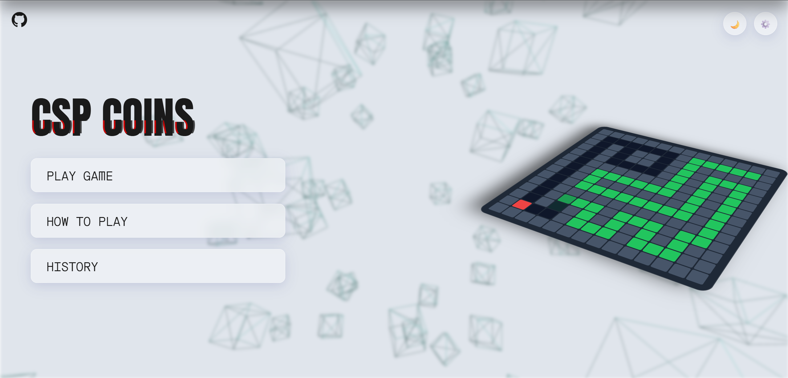

<!-- HERO BANNER -->

<!-- TYPING ANIMATION -->

  

<!-- TECH BADGES -->

  

<!-- NAVIGATION MENU -->
<h3>
  <a href="#-about-the-project">🌌 About</a> &nbsp;|&nbsp;
  <a href="#-key-features">✨ Features</a> &nbsp;|&nbsp;
  <a href="#-tech-stack">💻 Stack</a> &nbsp;|&nbsp;
  <a href="#-gameplay--controls">🎮 Gameplay</a> &nbsp;|&nbsp;
  <a href="#-api-architecture">🔌 API</a>
</h3>

<!-- ABOUT SECTION -->
<h2 id="-about-the-project">🌌 About The Project</h2>

<blockquote>
  

    Welcome to the <b>Intelligent Multi-Agent Maze Game</b>. This full-stack web application pits you against highly intelligent, autonomous agents inside a dynamically generated environment. By wrapping complex mathematical pathfinding algorithms in a premium, glassmorphic user interface, it delivers a visually stunning and deeply competitive experience.
  

</blockquote>

<!-- GAMEPLAY PREVIEW IMAGE (Linked to your local demo.png) -->

<!-- FEATURES SECTION (GRID FORMAT) -->
<h2 id="-key-features">✨ Key Features</h2>

<table align="center" style="border-collapse: collapse; width: 100%;">
  <tr>
    <td width="50%" valign="top" style="padding: 20px; border: 1px solid rgba(255,255,255,0.1); border-radius: 10px;">
      <h3 align="center">🎲 Procedural Generation</h3>
      
Every match features a brand-new, randomized maze generated using <b>Depth-First Search (DFS)</b> with an intelligent loop-creator to ensure multiple routing paths and complex evasion tactics.

    </td>
    <td width="50%" valign="top" style="padding: 20px; border: 1px solid rgba(255,255,255,0.1); border-radius: 10px;">
      <h3 align="center">🤖 Multi-Agent AI System</h3>
      
<b>The Monster:</b> Relentlessly tracks you using <b>A* Search</b> heuristic pathfinding. <b>The AI Competitor:</b> Uses a <b>Time-Safe BFS</b> engine to safely navigate, collect coins, and evade threats.

    </td>
  </tr>
  <tr>
    <td width="50%" valign="top" style="padding: 20px; border: 1px solid rgba(255,255,255,0.1); border-radius: 10px;">
      <h3 align="center">📸 Computer Vision Integration</h3>
      
Upload a physical drawing of a maze! The Python backend utilizes <b>OpenCV</b> binary thresholding to dynamically convert user-uploaded images into playable digital grids.

    </td>
    <td width="50%" valign="top" style="padding: 20px; border: 1px solid rgba(255,255,255,0.1); border-radius: 10px;">
      <h3 align="center">🎨 Premium Glassmorphic UI</h3>
      
Experience smooth, hardware-accelerated rendering with a <b>Three.js</b> 3D ambient background, fluid <b>GSAP</b> transitions, and an interactive, theme-shifting user interface.

    </td>
  </tr>
</table>

<!-- TECH STACK SECTION -->
<h2 id="-tech-stack">💻 Tech Stack</h2>

<b>Powered by industry-standard frameworks and libraries:</b>

  

<table align="center" width="80%" style="border-collapse: collapse;">
  <tr align="left">
    <th style="padding: 10px; border-bottom: 2px solid rgba(255,255,255,0.1);">Domain</th>
    <th style="padding: 10px; border-bottom: 2px solid rgba(255,255,255,0.1);">Technologies Used</th>
  </tr>
  <tr align="left">
    <td style="padding: 10px; border-bottom: 1px solid rgba(255,255,255,0.05);"><b>Backend Engineering</b></td>
    <td style="padding: 10px; border-bottom: 1px solid rgba(255,255,255,0.05);">Python 3, Flask, Flask-CORS, NumPy</td>
  </tr>
  <tr align="left">
    <td style="padding: 10px; border-bottom: 1px solid rgba(255,255,255,0.05);"><b>Computer Vision</b></td>
    <td style="padding: 10px; border-bottom: 1px solid rgba(255,255,255,0.05);">OpenCV (<code>cv2</code>)</td>
  </tr>
  <tr align="left">
    <td style="padding: 10px; border-bottom: 1px solid rgba(255,255,255,0.05);"><b>Frontend UI</b></td>
    <td style="padding: 10px; border-bottom: 1px solid rgba(255,255,255,0.05);">HTML5 Canvas, CSS3, Vanilla JS</td>
  </tr>
  <tr align="left">
    <td style="padding: 10px; border-bottom: 1px solid rgba(255,255,255,0.05);"><b>Visual Engine</b></td>
    <td style="padding: 10px; border-bottom: 1px solid rgba(255,255,255,0.05);">Three.js (3D Environment), GSAP (Animations)</td>
  </tr>
  <tr align="left">
    <td style="padding: 10px; border-bottom: 1px solid rgba(255,255,255,0.05);"><b>Core AI Algorithms</b></td>
    <td style="padding: 10px; border-bottom: 1px solid rgba(255,255,255,0.05);">DFS, BFS, A* Search, Constraint Satisfaction (CSP)</td>
  </tr>
</table>

<!-- GAMEPLAY CONTROLS SECTION -->
<h2 id="-gameplay--controls">🎮 Gameplay & Controls</h2>

 

<table align="center" width="80%">
  <tr align="center">
    <td>
      <h3>Movement</h3>
      <kbd style="background-color: #1e293b; color: white; padding: 10px 15px; border-radius: 8px; font-size: 18px; box-shadow: 0 4px #0f172a;">W</kbd>  
      <kbd style="background-color: #1e293b; color: white; padding: 10px 15px; border-radius: 8px; font-size: 18px; box-shadow: 0 4px #0f172a;">A</kbd>
      <kbd style="background-color: #1e293b; color: white; padding: 10px 15px; border-radius: 8px; font-size: 18px; box-shadow: 0 4px #0f172a;">S</kbd>
      <kbd style="background-color: #1e293b; color: white; padding: 10px 15px; border-radius: 8px; font-size: 18px; box-shadow: 0 4px #0f172a;">D</kbd>
    </td>
    <td align="left" style="padding-left: 40px; line-height: 1.8;">
      🟦 <b>You (Blue):</b> Navigate safely and collect coins. 
      🟨 <b>Coins (Yellow):</b> Boost your score. 
      🟩 <b>AI Competitor (Green):</b> Will try to steal your coins and escape. 
      🟥 <b>Monster (Red):</b> Will hunt whoever is closest or has the highest score. 
      🟪 <b>Exits (Purple):</b> Unlock after 15 turns. Reach them to win!
    </td>
  </tr>
</table>

<!-- API ARCHITECTURE SECTION -->
<h2 id="-api-architecture">🔌 API Architecture</h2>

The backend operates as a headless game engine, communicating with the frontend via the following REST endpoints:

<table align="center" width="90%" style="border-collapse: collapse;">
  <tr align="left" style="background-color: rgba(255,255,255,0.05);">
    <th style="padding: 15px; border-radius: 10px 0 0 0;">Endpoint</th>
    <th style="padding: 15px;">Method</th>
    <th style="padding: 15px; border-radius: 0 10px 0 0;">Functionality</th>
  </tr>
  <tr align="left">
    <td style="padding: 15px; font-family: monospace; font-size: 16px;">/api/state</td>
    <td style="padding: 15px;"></td>
    <td style="padding: 15px;">Retrieves the current game matrix, entity coordinates, and score metrics.</td>
  </tr>
  <tr align="left">
    <td style="padding: 15px; font-family: monospace; font-size: 16px;">/api/move</td>
    <td style="padding: 15px;"></td>
    <td style="padding: 15px;">Submits human movement vectors and calculates the subsequent game tick.</td>
  </tr>
  <tr align="left">
    <td style="padding: 15px; font-family: monospace; font-size: 16px;">/api/reset</td>
    <td style="padding: 15px;"></td>
    <td style="padding: 15px;">Re-initializes the game state and generates a fresh procedural maze.</td>
  </tr>
  <tr align="left">
    <td style="padding: 15px; font-family: monospace; font-size: 16px;">/api/upload</td>
    <td style="padding: 15px;"></td>
    <td style="padding: 15px;">Processes a multipart image via OpenCV to output a custom binary grid.</td>
  </tr>
</table>

<!-- FOOTER -->

 
<b>Developed by <a href="https://github.com/your-username" style="color: #38bdf8; text-decoration: none;">Huzaifa Waqar</a></b>  
<i>BS Artificial Intelligence | FAST-NUCES</i>

